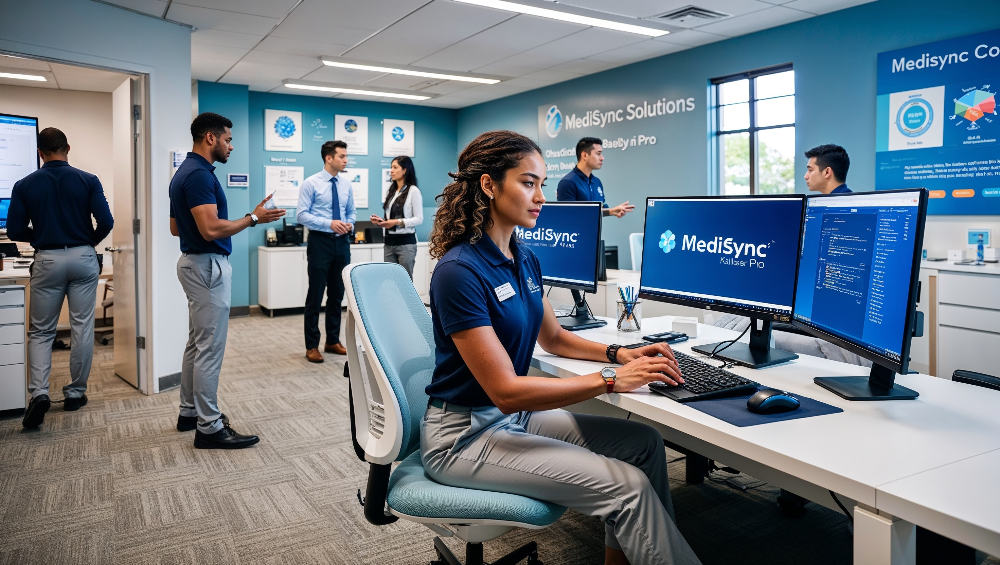

# Iara Fernandes Oliveira: Programadora Java em Ascensão

## Perfil

**Nome:** Iara Fernandes Oliveira
**Idade:** 24 anos
**Origem:** Pato Branco - PR
**Profissão:** Programadora Java Júnior
**Estado Civil:** Solteira

## Características Físicas

- **Altura:** 1,75m
- **Corpo:** Atlética, com curvas sutis
- **Pele:** Parda
- **Cabelos:** Enrolados, volumosos e castanho-escuros, com mechas coloridas rosa e laranja
- **Olhos:** Cor de mel, grandes e expressivos
- **Estilo:** Camisetas geek, jeans e tênis coloridos

## Personalidade

- Introvertida, mas calorosa com amigos próximos
- Extremamente curiosa e ávida por conhecimento
- Perfeccionista em relação ao seu trabalho
- Ansiosa frente a novos desafios
- Leal e dedicada aos amigos e projetos
- Tímida socialmente, eloquente sobre tecnologia
- Senso de humor nerd, repleto de referências pop
- Cor favorita: Laranja
- Série favorita: Star Trek
- Animais favoritos: Coruja e Lobo
- Número da sorte: 27

## História de Vida

Nascida em Pato Branco, Iara descobriu sua paixão por programação ainda jovem. Formada em Ciência da Computação pela UFPR, trabalhou por um ano em uma empresa tradicional antes de se juntar a uma startup promissora em São Paulo. Com quase dois anos de experiência, ela enfrenta o desafio de desenvolver um sistema de diagnóstico auxiliado por IA.

## Cena: Iara no Escritório da Startup

Uma jovem programadora de 24 anos, está sentada em um escritório moderno e vibrante de uma startup. O espaço é aberto, com paredes de vidro e tijolo aparente, decorado com plantas e arte urbana colorida. Iara está em frente a uma estação de trabalho ergonômica, com dois monitores de tela plana exibindo linhas de código Java.
Ela veste uma camiseta geek preta com o logotipo do Java, jeans azul e tênis coloridos. Seus cabelos enrolados e volumosos, castanho-escuros com mechas rosa e laranja, estão soltos, caindo em cascata sobre seus ombros e emoldurando seu rosto. Iara tem uma expressão concentrada, com seus grandes olhos cor de mel focados na tela enquanto digita em um teclado mecânico.
Ao lado do teclado, há uma caneca de café fumegante com o logotipo da startup. O ambiente ao redor é dinâmico, com outros jovens profissionais trabalhando em mesas próximas ou em áreas de descontração com puffs e uma mesa de pingue-pongue ao fundo.
Na parede atrás de Iara, há um quadro branco com diagramas e notas sobre o projeto de diagnóstico auxiliado por IA em que ela está trabalhando. Perto de sua mesa, há uma estante com livros técnicos sobre Java, Inteligência Artificial e uma pequena coleção de figures de personagens de Star Trek.

Negativo: Deformações, distorções, proporções incorretas, anatomia errada, membros extras, dedos a mais, mãos ou pés deformados, características faciais assimétricas, olhos desalinhados, boca mal posicionada, nariz deformado, orelhas mal posicionadas, pescoço anormal, ombros desproporcionais, braços ou pernas irregulares, corpo desproporcional, cabeça desproporcional, cabelo não natural, roupas mal ajustadas, objetos duplicados, monitores extras, teclados múltiplos, partes do corpo extras, cadeiras ou mesas duplicadas, plantas duplicadas, canecas extras, livros flutuantes, figures mal posicionadas, quadros brancos múltiplos, paredes inconsistentes, janelas duplicadas, luzes estranhas, sombras inconsistentes, reflexos irrealistas, texturas borradas, perspectiva incorreta, falta de profundidade, elementos 2D em 3D, artefatos digitais, pixelização, ruído excessivo, bordas irregulares, olhos cruzados, pupilas deformadas, dentes estranhos, língua visível, boca aberta, expressão facial não natural, postura não natural, dedos dos pés visíveis

## Contexto Atualizado: Iara na MediSync Solutions

## Cenário

Iara Fernandes Oliveira, programadora Java júnior de 24 anos, trabalha na MediSync Solutions, uma startup inovadora de healthtech em São Paulo. A empresa desenvolve o MediSync Pro, um sistema abrangente de gestão para clínicas médicas.

## Posição de Iara

- **Cargo:** Desenvolvedora Java Júnior
- **Tempo na empresa:** 1 ano e 8 meses
- **Equipe:** Desenvolvimento de Backend

## Projeto Atual

Iara está envolvida no desenvolvimento de um novo módulo de IA para auxílio diagnóstico, uma das iniciativas estratégicas da MediSync para expandir suas capacidades tecnológicas.

## Desafios

1. Integrar algoritmos de machine learning com o sistema existente.
2. Garantir a segurança e privacidade dos dados dos pacientes.
3. Otimizar o desempenho do sistema para lidar com análises em tempo real.
4. Colaborar com a equipe médica para validar a precisão do módulo de IA.

## Ambiente de Trabalho

- Equipe jovem e dinâmica de 28 funcionários.
- Cultura startup com foco em inovação e rápido crescimento.
- Ambiente que incentiva a aprendizagem contínua e a experimentação.

## Objetivos de Iara

1. Aprimorar suas habilidades em IA e machine learning.
2. Contribuir significativamente para o sucesso do novo módulo.
3. Crescer profissionalmente dentro da MediSync Solutions.
4. Ajudar a empresa a atingir sua visão de liderança no mercado latino-americano.

## Tecnologias Utilizadas

- Java (principal linguagem de backend)
- Spring Framework
- MySQL para banco de dados principal
- MongoDB para armazenamento de dados não estruturados
- Docker para containerização
- AWS para infraestrutura em nuvem
- TensorFlow e PyTorch para modelos de IA

Este contexto coloca Iara no centro de um projeto desafiador e inovador, alinhado com sua paixão por tecnologia e seu desejo de crescimento profissional.
